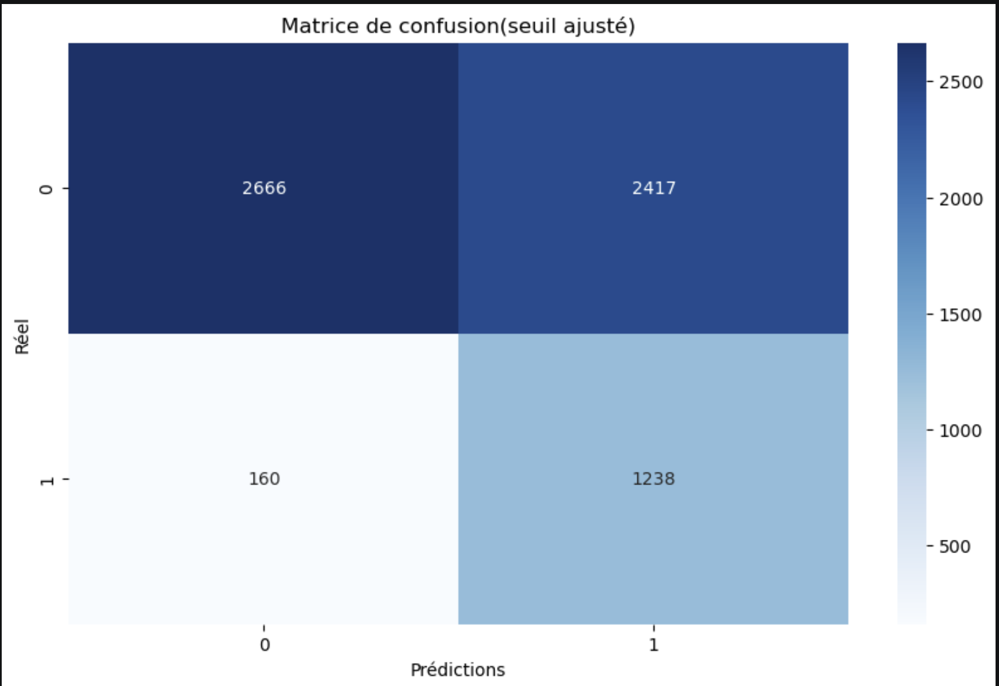
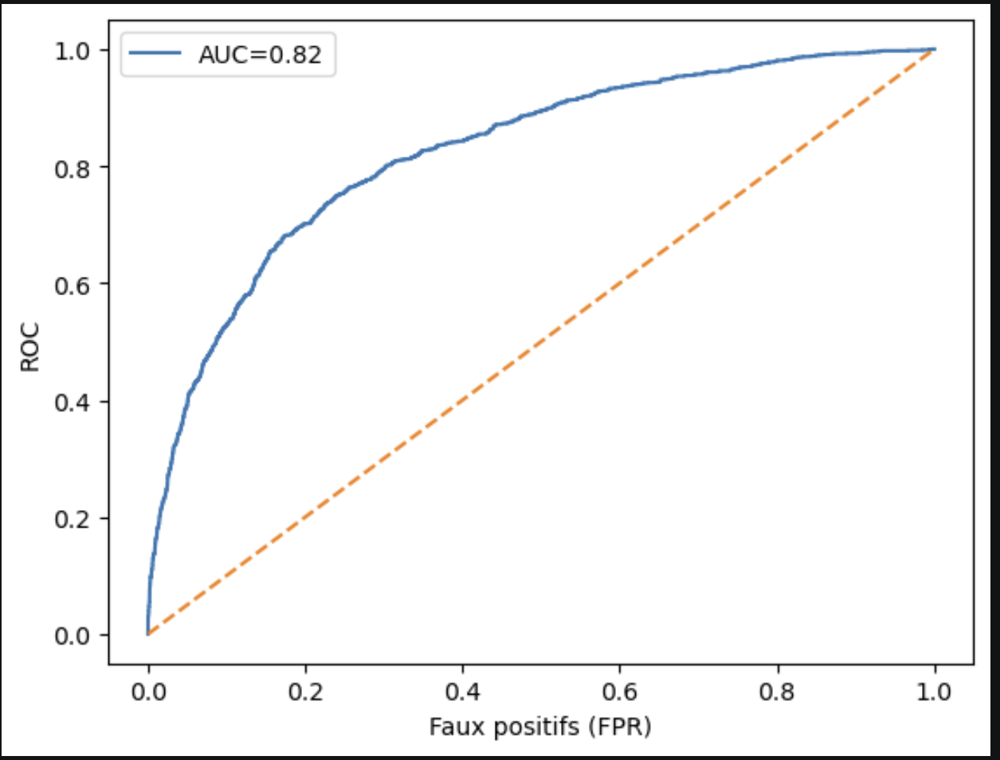
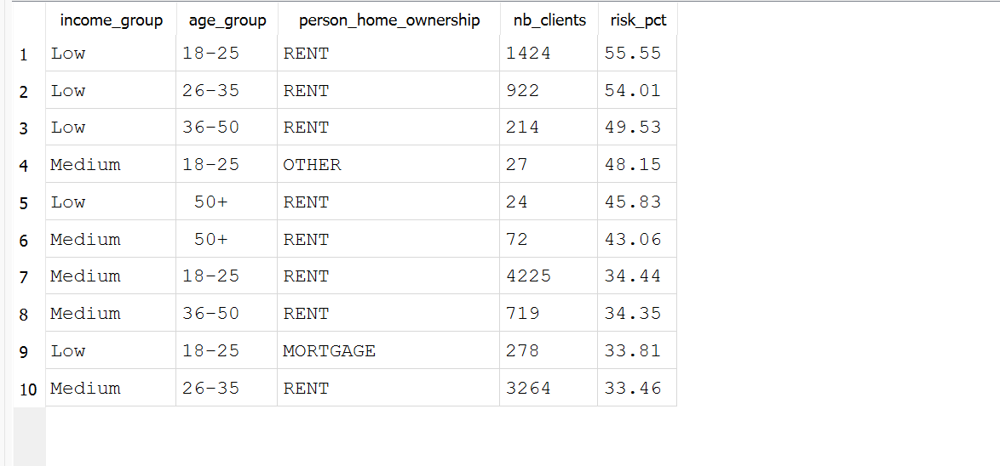
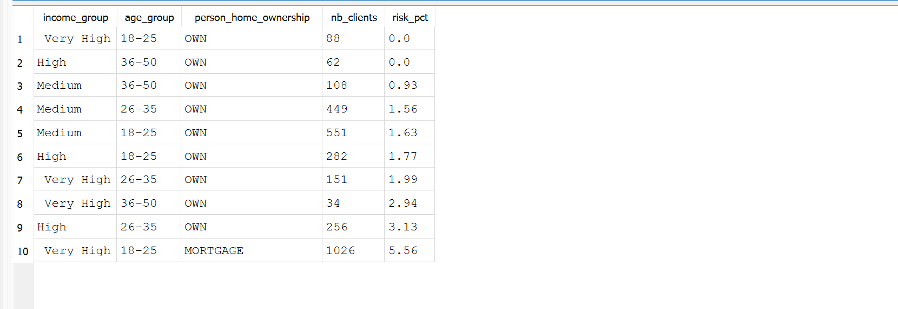
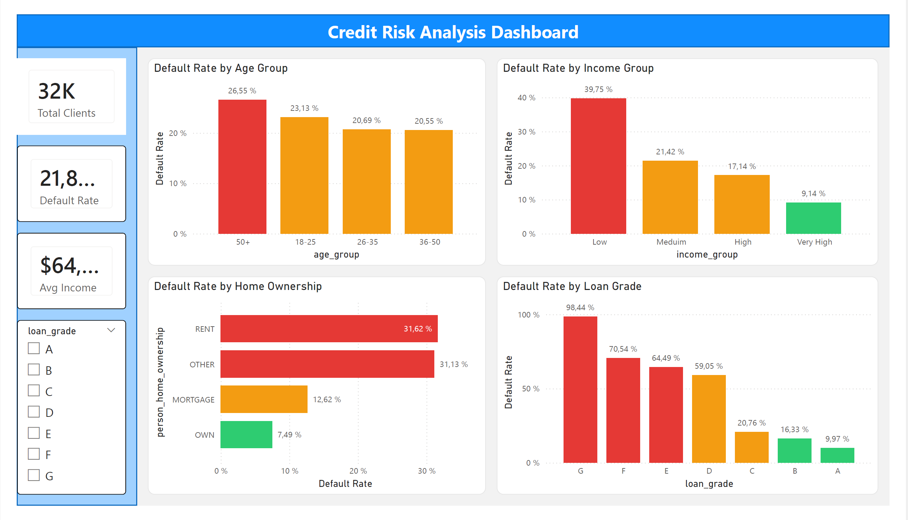

# 📊 Credit Risk Analysis | Python . SQL . Power BI

---

## 📌 Présentation du projet

Ce projet vise à analyser le **risque de crédit des clients** afin d’identifier les profils les plus susceptibles de faire défaut.

L’objectif est de transformer des données brutes en **insights exploitables** pour aider à la prise de décision dans un contexte financier.

Dans le secteur financier, une mauvaise évaluation du risque peut entraîner des pertes importantes. Il est donc essentiel d’identifier les profils à risque avant l'octroi d'un prêt.

Le projet combine trois outils principaux :

- **Python** : nettoyage, analyse exploratoire et modélisation
- **SQL** : extraction d’insights et segmentation des clients
- **Power BI** : création d’un dashboard interactif

---

## 🎯 Objectifs du projet

- Identifier les profils clients à **haut risque**
- Comprendre les facteurs influençant le défaut de paiement
- Construire un **modèle de prédiction**
- Créer un **dashboard interactif** pour visualiser les résultats

---

👉 **Problématique :**
**Comment détecter efficacement les clients susceptibles de faire défaut ?**

---
## 📂 Dataset & Source des données

Le dataset contient des informations sur :

- les revenus des clients
- leur âge
- leur statut de logement
- les caractéristiques du prêt
- le statut de défaut

👉 Variable cible :
- 'loan_status'

(0 = non défaut, 1 = défaut)

---
⚠️ Le fichier étant trop volumineux, il n’est pas inclus dans ce repository.

👉 Vous pouvez utiliser un dataset similaire sur :
- Kaggle (Credit Risk / Loan Prediction datasets)

---

## 🛠️ Technologies utilisées

- **Python** (Pandas, NumPy, Scikit-learn, Matplotlib, Seaborn)
- **SQL (SQLite)** pour l’analyse des données
- **Power BI** pour la visualisation
- **Jupyter Notebook**

---

## 🧠 Importance des outils utilisés

Chaque outil joue un rôle complémentaire dans le projet :

- **Python** → nettoyage des données, transformation et modélisation
- **SQL** → exploration rapide et identification des segments à risque
- **Power BI** → visualisation claire et interactive pour la prise de décision

👉 Ensemble, ces outils couvrent toute la chaîne :
**data → analyse → prédiction → visualisation → décision**

---
## 📁 Structure du projet

```
Credit_Risk_Analysis/
│--- data/
│--- notebook/
│--- sql/
│--- power_bi/
│--- images/
│--- clean_credit_risk.csv

```

---

## 🔄 Étapes du projet

### 1. Nettoyage & préparation des données (Python)

- gestion des valeurs manquantes
- suppression des doublons
- traitement des données
- création de nouvelles variables

Variables créées :
- income_group
- age_group
- debt_to_income

---

### 2. Analyse exploratoire (EDA)

- Analyse des distributions
- Identification des variables importantes
- Analyse du déséquilibre des classes

---

### 3. Modélisation (Machine Learning)

Modèle utilisé : **Régression logistique**

#### Étapes :
- séparation des données (train/test)
- entraînement du modèle
- prédiction
- évaluation

---

## ⚠️ Problème du modèle initial

- Accuracy ≈ 83%
- Recall ≈ 38%

👉 Le modèle ne détecte pas correctement les clients à risque
➡️ 62% des défauts ne sont pas identifiés

---

## 🔧 Amélioration du modèle

Afin d’améliorer les performances :

- gestion du déséquilibre des classes
- utilisation des probabilités
- ajustement du seuil de décision

👉 Résultat :

- Recall ≈ 89%
- meilleure détection des défauts

---

## 📈 Évaluation du modèle

#### 📌 Matrice de confusion


#### 📌 Courbe ROC


👉 AUC = 0.82 → bonne capacité du modèle à distinguer les classes

---

### 4. Analyse SQL

Utilisation de SQL pour extraire des insights business :

- Identification des profils les plus risqués
- Analyse par revenu, âge et statut de logement

#### 📌 Clients les plus à risque


👉Résultat clé :
Les clients à **faible revenu** et **locataires (RENT)** présentent le plus haut risque.

#### 📌 Clients les moins à risque


---

### 5. Dashboard Power BI

Un dashboard interactif a été développé pour faciliter l’analyse du risque.

### Il permet de visualiser :

- le taux de défaut par âge
- le taux de défaut par revenu
- le taux de défaut par statut de logement
- le taux de défaut par grade

🎨 Code couleur :

- 🔴= Risque élevé
- 🟠= Risque moyen
- 🟢= Faible risque

#### 📊 Aperçu du dashboard


👉Ce dashboard permet aux équipes crédit d’identifier rapidement les segments à risque et d’adapter leurs décisions.

---
## 🏦 Cas d’usage

Ce projet peut être utilisé par une institution financière pour :

- automatiser l’évaluation du risque client  

- réduire les défauts de paiement  

- améliorer la rentabilité du portefeuille de crédit  

- optimiser les décisions d’octroi de prêts  

---

## 💡 Insights clés

- Le revenu est le facteur principal du risque
- Les locataires présentent un risque élevé
- Le grade du prêt est fortement corrélé au défaut
- Certains groupes d’âge sont plus exposés

---

## 📊 Résultats principaux

- Les clients à faible revenu présentent le risque le plus élevé  
- Les locataires (RENT) sont plus exposés au défaut  
- Le modèle atteint une AUC ≈ 0.82  
- Amélioration significative du recall (détection des défauts)

---

## 💼 Solutions proposées

- Renforcer les critères pour les clients à faible revenu  

- Surveiller davantage les profils locataires  

- Adapter les taux selon le niveau de risque  

- Mettre en place un scoring automatique  

- Cibler les profils à faible risque pour offres premium  

👉 Ces actions permettent de réduire le risque et d’optimiser la prise de décision.

---
## 💼 Impact métier

Ce projet permet :

- de mieux détecter les clients à risque
- de réduire les pertes financières
- d’améliorer les décisions de crédit

---

## 🚀 Améliorations possibles

- Tester des modèles plus performants (Random Forest, XGBoost)
- Optimiser les hyperparamètres
- Améliorer la gestion du déséquilibre des classes
- Déployer le modèle (API ou application)

👉 Il transforme des données brutes en **outil d’aide à la décision stratégique**

---

# 🏁 Conclusion

Ce projet démontre l’importance de l’analyse de données dans la gestion du risque de crédit.

Le modèle développé permet d’identifier efficacement les clients à risque tout en mettant en évidence les facteurs clés influençant le défaut.

Le dashboard Power BI offre une **visualisation claire et interactive**, facilitant la prise de décision.

👉 Ce projet illustre comment la data peut transformer un processus critique en finance en un système analytique performant.


## 👤 Auteur

Projet réalisé par **Cliford Cupidon**
